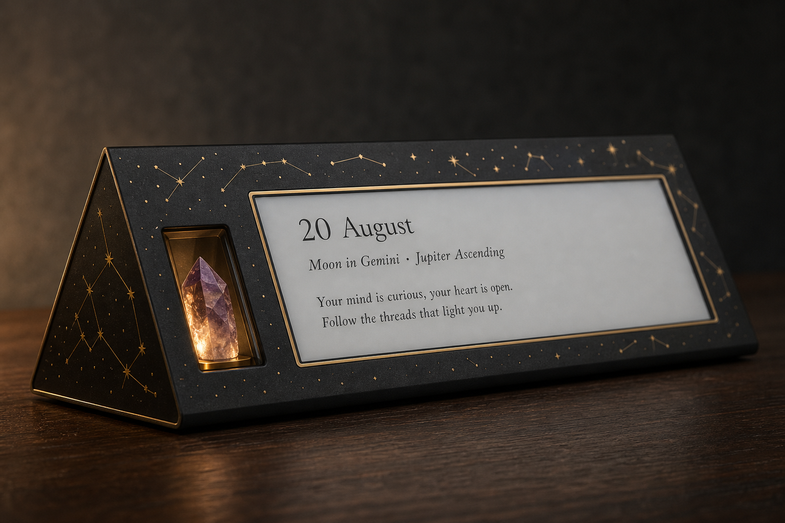
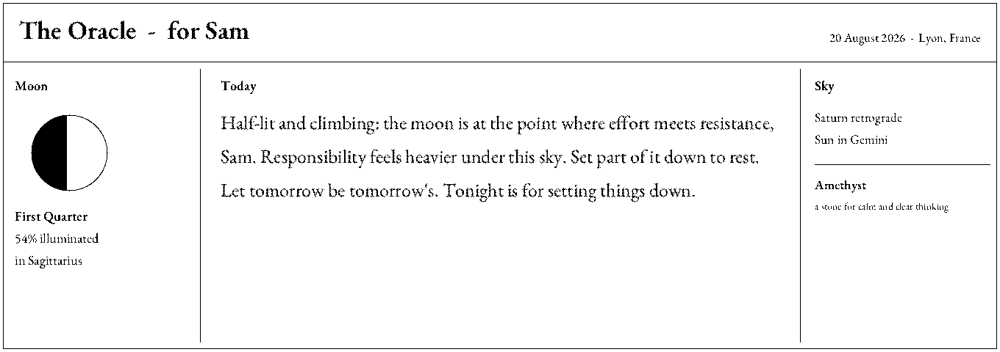
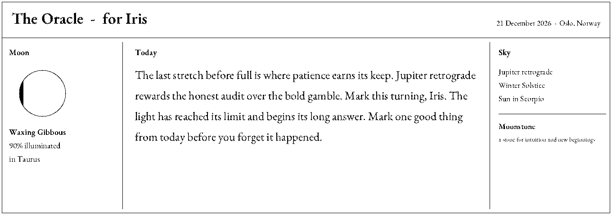
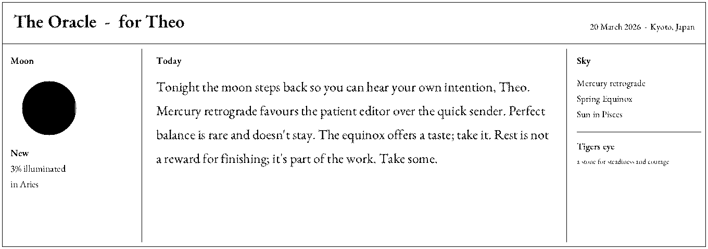
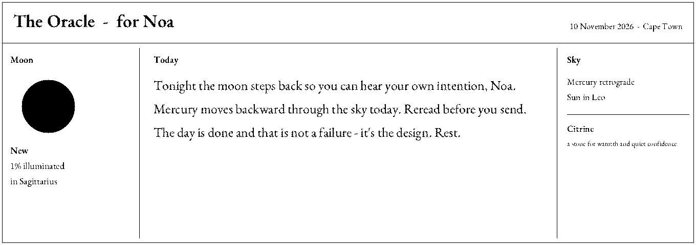

# The Oracle — Almanac & Stone

A personal e-ink almanac that greets you each morning with a short, warm,
astronomically-grounded reflection. Real sky math — moon phase, zodiac signs,
planetary retrogrades, solstices — becomes an ever-changing seed for a
thoughtful daily message. **Reflection, never prediction.**



> *20 August — Moon in Gemini · Jupiter Ascending*
> *"Your mind is curious, your heart is open. Follow the threads that light you up."*

The device is a small triangular desk piece: a glowing crystal in the front
slot, gold constellations across the case, and a wide **1360×480 e-ink panel**
showing today's date, the state of the sky, and your message. It runs fully
**offline on an ESP32** — no network at generation time, e-ink holds the image
at zero power between daily refreshes.

---

## What makes it different

- **Real astronomy, not random text.** Meeus-style formulas compute moon phase
  & illumination, tropical sun sign, moon sign (from ecliptic longitude), the
  day's most-relevant planet (from a hardcoded 2024–2030 retrograde calendar),
  and solstice/equinox proximity.
- **Deterministic.** The same person on the same day always gets the same
  message; different people differ. Seeded from `(date, birthdate)` with a
  portable integer hash, so results are reproducible and testable — and
  identical on desktop and on the ESP32.
- **Genuinely varied writing.** A hand-written bank of **278 fragments** across
  moon phases, planetary states, seasons, and tones, assembled into a coherent
  40–70 word paragraph with a 30-day rolling history so no two recent days
  repeat.
- **Safe by construction.** Every message passes a content filter that rejects
  predictive-certainty, medical, financial, and legal language before display.

---

## Samples

Rendered exactly as the e-ink panel shows them (1360×480, 1-bit):

| | |
|---|---|
| First quarter · Saturn retrograde | Winter solstice · Jupiter retrograde |
|  |  |
| Spring equinox | New moon · Mercury retrograde |
|  |  |

---

## Repository layout

```
almanac/
├─ oracle_generator/       Python engine (source of truth)
│  ├─ astronomy.py          moon/sun/moon-sign, retrogrades, seasons, seed
│  ├─ fragments.py          the 278-fragment message bank  ← edit content here
│  ├─ composer.py           deterministic selection + history + assembly
│  └─ safety.py             predictive/medical/financial/legal filter
├─ oracle.py               interactive CLI: asks birthdate, location, crystal
├─ test_harness.py         20 sample messages + sanity checks
├─ firmware/               ESP32 / e-ink C++ port (see firmware/README.md)
│  ├─ src/                  portable core: astro, composer, render, serif text
│  ├─ fonts/                EB Garamond (ASCII subset, SIL OFL) + license
│  ├─ third_party/          stb_truetype.h (public domain)
│  ├─ main.cpp              desktop preview → writes a .bmp
│  ├─ build_desktop.sh      regenerates fragments + font, compiles
│  └─ esp32/oracle_esp32.ino  on-device wrapper (RTC → render → e-ink → sleep)
├─ tools/gen_fragments_cpp.py  generates firmware/src/oracle_fragments.h
├─ tools/gen_font_cpp.py       embeds the serif into oracle_font_ttf.h
├─ images/                 sample renders (this README)
├─ vision.png              product vision render
└─ project.md              master project document
```

---

## Quickstart — Python

```bash
# Interactive: asks for name, birthdate, location, and a crystal
python3 oracle.py

# Non-interactive
python3 oracle.py --birth 1990-06-15 --name Sam --place Lyon \
    --crystal amethyst --date 2026-08-20

# Review 20 sample messages + run sanity checks
python3 test_harness.py
```

Use the engine directly:

```python
from datetime import date
from oracle_generator import generate_daily_message

print(generate_daily_message(
    birth_date=date(1990, 6, 15), birth_time=None, birth_place=None,
    target_date=date(2026, 8, 20), name="Sam"))
```

## Quickstart — C++ / e-ink preview

```bash
./firmware/build_desktop.sh        # regenerate fragments + compile oracle_cpp
./oracle_cpp --birth 1990-06-15 --name Sam --place Lyon \
    --crystal amethyst --date 2026-08-20 --out reading.bmp
```

`reading.bmp` is a pixel-exact preview of the panel. The C++ engine produces
**byte-identical messages to the Python engine** for the same inputs. For the
ESP32 build, panel wiring, and memory notes, see
[`firmware/README.md`](firmware/README.md).

---

## Design philosophy

The Oracle is deliberately **not** fortune-telling. It never claims certainty
about the future, and never gives medical, financial, or legal advice. The
astronomical data is treated as a rich, structured, ever-changing prompt for
warm and useful writing — closer to a stoic quote-of-the-day than a horoscope
that pretends to predict events. The crystal you choose is a personal ritual
touch, kept clearly separate from the (real) astronomy.

## Notes & limitations

- Retrograde tables cover **2024–2030**; extend `RETROGRADES` (Python) and the
  window tables (C++) for a longer horizon.
- The lunar series is truncated (~0.3° accuracy) — ample for naming a phase or
  sign except within minutes of a boundary.
- `firmware/esp32/oracle_esp32.ino` uses a **placeholder GxEPD2 panel class**;
  swap in the exact driver for your controller before flashing.
- `oracle_generator/fragments.py` is the single source of truth for message
  content — never hand-edit the generated `firmware/src/oracle_fragments.h`.

## Credits

Typeset in **EB Garamond** by Georg Duffner & Octavio Pardo, used under the
[SIL Open Font License 1.1](firmware/fonts/EBGaramond-OFL.txt). TrueType
rasterisation by [stb_truetype](https://github.com/nothings/stb) (public
domain).
