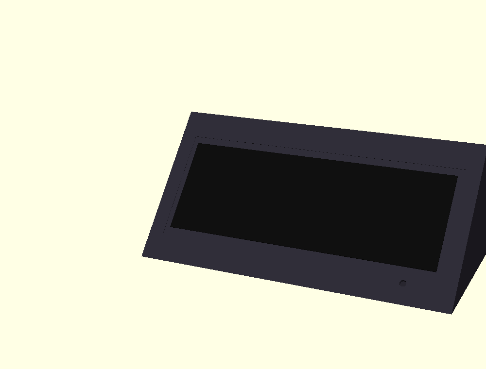
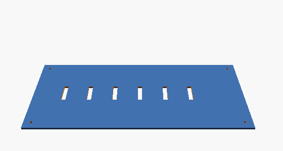

# Almanac Stone — prototype blueprint

A 3D-printable "Toblerone" (triangular-prism) desk enclosure for the
Waveshare 10.85" e-Paper HAT+ (G), an ESP32-WROVER, an RTC, and a lit crystal.



## Overall form

A right-triangular prism resting on its base, with the front face tilted back
so the wide screen faces up toward a seated viewer.

| Dimension | Value | Driven by |
|-----------|-------|-----------|
| Width (X) | **300 mm** | panel outline 270.56 mm + side walls + margin |
| Depth / base (Y) | **150 mm** | stability + room for electronics inside |
| Height (Z) | **120 mm** | screen height on the slope + interior clearance |
| Front-face lean | **20° from vertical** | comfortable desk reading angle |
| Wall thickness | **3.2 mm** | rigidity in PLA/PETG |
| Screen active area | 259.76 × 91.68 mm | the panel |
| Panel outline / rebate | 270.56 × 105.92 × 1.2 mm | glass drops into this recess |

All dimensions are parameters at the top of
[`scad/almanac_stone.scad`](../scad/almanac_stone.scad) — change one line and
re-render.

## Parts (in `hardware/stl/`)

| Part | File | Prints | Notes |
|------|------|--------|-------|
| Left body half | `almanac_left.stl` | on its flat seam face | hollow; carries most cutouts |
| Right body half | `almanac_right.stl` | on its flat seam face | joins the left at X-mid |
| Base plate | `almanac_base.stl` | flat | screws on; vents + electronics access |
| Screen bezel | `almanac_bezel.stl` | flat | frames the display, holds the glass |

  

### Why it splits
At 300 mm the body is wider than most print beds (220–256 mm), so it prints as
**two halves** meeting at a vertical seam at the width centre. Three **4 mm
dowel holes** align the halves; glue after test-fitting the electronics.

## Print settings (starting point)

- **Material:** PLA (easy) or PETG (heat-tolerant). Dark / matte suits the look.
- **Layer height:** 0.2 mm.
- **Walls/perimeters:** 3. **Top/bottom:** 4 layers. **Infill:** 15% gyroid.
- **Orientation:**
  - Body halves: **seam face down** on the bed (the large flat interior split
    plane) — gives a clean outer surface and easy supports.
  - Base & bezel: flat, as exported.
- **Supports:** needed inside the screen recess / FPC slot overhangs. Tree/organic
  supports work well; support-on-build-plate only where possible.
- **Estimated filament:** ~200–260 g for the pair of halves.

## Assembly order

1. **Test the electronics first** on the bench (see `electronics.md`) — get the
   Waveshare demo image showing before you commit to the enclosure.
2. Print all four parts. Clean the seam faces and dowel holes.
3. Dry-fit the two halves with the 3 dowels. Check the screen recess accepts the
   panel outline (259.76 active shows through; 270.56 outline sits in the rebate).
4. Seat the panel from the front into its rebate; route the **FPC through the
   slot** at the lower screen edge into the interior. Attach the driver HAT.
5. Mount the **ESP32-WROVER** and **RTC** to the base plate (double-sided tape or
   M3 into printed bosses — add bosses in the SCAD if wanted).
6. Fit the **LED / WS2812** behind the crystal well `led_hole`, with a scrap of
   frosted diffuser. Seat the crystal in the well.
7. Wire per the pin table in `electronics.md`. Power via USB for first light.
8. Glue the halves; screw on the base plate; add rubber feet.

## Known limitation (be aware)

The screen is 259.76 mm wide on a 300 mm face, leaving only ~20 mm of face
beside it — **not enough for a large crystal next to the screen** as in the
marketing render. The prototype puts the crystal **well low on the front-left**,
below the screen. For the product look (prominent side crystal), either:
- widen the body to ~330–340 mm, or
- move the crystal to the **left triangular end face**, or
- make the screen inset asymmetric (shift it right, crystal column on the left).

These are one-parameter changes in the SCAD; flagged here so the prototype's
proportions aren't mistaken for final.

## Regenerating the files

```bash
cd hardware
for p in left right base bezel; do
  openscad -o stl/almanac_$p.stl -D "part=\"$p\"" scad/almanac_stone.scad
done
# preview:  openscad -o /tmp/asm.png -D 'part="assembly"' scad/almanac_stone.scad
```
